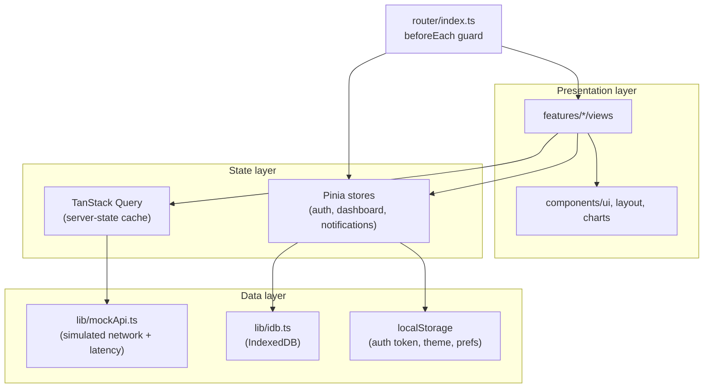

# dashboard-vue

A production-shaped analytics dashboard built with Vue 3, TypeScript, and the Composition API. All data is served by a typed mock API with simulated network latency — no backend required.

## Tech stack

- **Vue 3** (`<script setup>`, Composition API) + **TypeScript**
- **Vite** for dev/build tooling
- **Pinia** for client/UI state
- **Vue Router 4** with auth + role-based route guards
- **TanStack Query** (`@tanstack/vue-query`) for server-state fetching/caching
- **TanStack Table** (`@tanstack/vue-table`) for the orders data grid
- **vue-chartjs** + **Chart.js** for line/bar/pie/donut/sparkline charts
- **Tailwind CSS** + hand-built shadcn-vue-style primitives on **reka-ui**
- **Zod** for form validation
- **VueUse** (`useDark`) for theme handling
- Native **IndexedDB** wrapper for notification persistence

## Getting started

```bash
npm install
npm run dev      # start dev server
npm run build    # type-check + production build
npm run preview  # preview the production build
```

Demo accounts (mock auth, no backend):

| Role   | Email               | Password  |
| ------ | -------------------- | --------- |
| admin  | admin@dashboard.dev  | admin123  |
| viewer | viewer@dashboard.dev | viewer123 |

## Architecture



### State management split

- **Pinia** owns *client/UI state*: the authenticated user and mock JWT-like token (`authStore`, persisted to `localStorage`), the global date-range/search filters (`dashboardStore`), and notifications with their read/unread state (`notificationStore`, persisted to IndexedDB via `lib/idb.ts`).
- **TanStack Query** owns *server state*: KPI metrics, chart datasets, channel breakdowns, and the orders table, all fetched from `lib/mockApi.ts`. Query keys include the active date range so widgets refetch automatically when `dashboardStore.dateRange` changes. Query handles caching, loading/error state, and invalidation (e.g. after a bulk delete in the data table).
- Composables bridge the two: `useMetrics` wraps TanStack Query calls scoped to the current filter state, `useLiveFeed` simulates a push stream with `setInterval` and feeds both the dashboard's live activity list and (optionally) the notification store, and `useCommandPalette` implements global ⌘K search with a hand-written fuzzy matcher (no fuse.js).

## Folder structure

```
src/
  main.ts, App.vue          — app bootstrap, Pinia/Router/Vue Query wiring
  router/                   — routes + auth/role guards
  styles/                   — Tailwind entry + CSS theme tokens (light/dark)
  types/                    — shared TypeScript types
  lib/                      — zod schemas, CSV export, mock API, IndexedDB helper
  stores/                   — Pinia stores (auth, dashboard, notifications)
  composables/               — useMetrics, useLiveFeed, useCommandPalette, useDark
  components/
    ui/                     — shadcn-vue-style primitives (button, input, card, dialog, …)
    layout/                 — AppShell, Sidebar, Topbar, BottomNav, MobileDrawer, CommandPalette
    charts/                 — LineChart, BarChart, PieChart, DonutChart, Sparkline, skeletons
  features/
    dashboard/              — KPI overview, sparklines, date-range picker
    datatable/               — sortable/filterable/paginated orders table
    auth/                    — login, 403, 404 views
    notifications/            — notification center dropdown
    settings/                 — theme, profile form, notification prefs
    reporting/                — printable report + CSV export
```

## Features

- **Dashboard home** — KPI stat cards with sparklines, global 7d/30d/90d/custom date-range picker, responsive grid.
- **Data table** — client-side sorting/filtering/pagination, column visibility toggle, CSV export, row selection with a bulk-actions toolbar (delete/export selected).
- **Charts** — line/bar/pie/donut, theme-aware colors that react to dark mode, loading skeletons, and empty states.
- **Auth** — mock login issuing a fake token in `localStorage`, `router.beforeEach` guard, role-based route access (`meta.roles`) with a 403 fallback.
- **Live-updating metrics** — simulated SSE/polling stream (`setInterval`) driving a real-time activity feed.
- **Notifications** — dropdown with unread badge, mark-as-read (single + all), persisted in IndexedDB and hydrated on app init.
- **Settings** — dark-mode toggle, Zod-validated profile form, notification preference switches, all persisted to `localStorage`.
- **Command palette** — ⌘K / Ctrl+K dialog with keyboard navigation and a lightweight custom fuzzy search over nav routes.
- **Responsive shell** — collapsible desktop sidebar + topbar, mobile bottom nav + slide-out drawer, no separate mobile router.
- **Reporting** — printable summary (`@media print`) and CSV export of the currently filtered dataset.

## Notable implementation decisions

- shadcn-vue is copy-paste-only, so `components/ui/*` are hand-built Tailwind components wired to `reka-ui` headless primitives (Dialog, DropdownMenu, Select, Switch) rather than an installed shadcn package.
- The mock API (`lib/mockApi.ts`) uses seeded pseudo-random generators so chart/table data is stable across reloads within a session, with `setTimeout`-based latency to exercise loading states realistically.
- The live feed is a `setInterval`-driven generator shaped like discrete stream events (`{ id, type, message, timestamp }`), decoupled from TanStack Query since it represents push data rather than request/response data.
- Notification persistence uses a small hand-written IndexedDB wrapper (`lib/idb.ts`) instead of the `idb` package, keeping the dependency list to what's explicitly requested.
